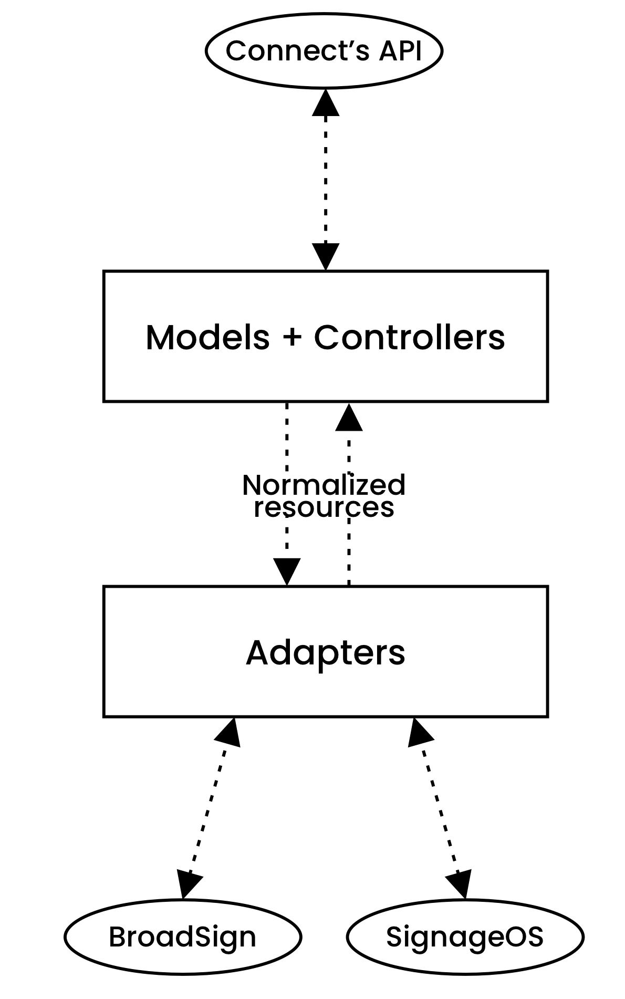

# The Broadcast Module

Connect's Broadcast module is a fully-fledged content management and scheduling.
It is able to interact with one or more external broadcasting systems at once, providing a unified method for uploading,
managing and scheduling content.

## Glossary

- **Creative**: A piece of media to play, can be an image, a video, a html file, a link, etc;
- **Content**: Also called ad, is a collection of one or more creative to be shown together;
- **Schedule**: Link between one or more contents and a campaign. A schedule has its own specific date and time for when
  it should play;
- **Player**: A computer able to display contents in a loop.
- **Location**: A collection of one or more player for easy access.
- **Campaign**: Makes the link between one or more schedules, and one or more locations. This is where you say "Play
  *this* content *there*".
- **Representation**: Broadcast resources inside Connect are the source of truth. Copies of them made on external
  broadcasters are called representation, as they may not match
  1-to-1 with the original.
- **To promote**: To synchronize a resource in Connect with its counterpart.s in the external broadcasters

## Architecture

The module architecture is made to be as broadcaster agnostic as possible. To do so, there is a strict separation of
concerns that split the codebase in two layers.



The **models and controllers layer** is where reside the traditional framework code, but it doesn't handle interaction
with external broadcasters, only with Connect's own database
and file storage (CDN).

The **Adapters layer** handle communication between Connect's and external broadcasters. Adapters are obtained through
the use of the `BroadcasterAdapterFactory` and share
interfaces between them providing a normalized set of functions and objects.

Since different broadcasters have different functionalities, obtained instances of adapters can be introspected using
the `hasCapability()` method to assess the presence of a
functionality on the current instance. Functionality supported by broadcasters are spread across multiple interfaces to
provide flexibility.

| Interface                     | Description                                   | BroadSign |
|-------------------------------|-----------------------------------------------|-----------|
| `BroadcasterLocations`        | List and interact with locations and players. | ✓         |
| `BroadcasterContainers `      | List folders used to store locations          | ✓         |
| `BroadcasterScheduling`       | Schedule creatives, ads and campaigns         | ✓         |
| `BroadcasterReporting`        | Get performance reports from campaigns        | ✓         |
| `BroadcasterScreenshotsBurst` | Request async screenshots burst               | ✓         |

Communication between the two layers is done exclusively through the use of normalized resources. No matter how an
external broadcaster works internally, it is the job of its
adapter to map its resources to the normalized one. This ensure that Connect's logic does not depend on the
specificities of external broadcaster.

This layers system is what makes it possible to schedule a campaign across multiple networks/broadcasters at once.

## Campaign representations

In Connect, a campaign can include multiple formats and locations from different networks, that may be on different
broadcasters. As such, replication of the campaign between
Connect and the different broadcasters cannot be made on a 1-to-1 basis. Connect deduces *representations* of a
campaign, that are each replicated individually. The breakdown of a
campaign into its *representations* is as such:

1. Break down the campaign by network
2. Break down the campaign by formats

Simplified example:

```php
$campaignLocations = [
  ["id" => 1, "network" => "broadsign", "format" => "DV"],
  ["id" => 2, "network" => "broadsign", "format" => "DH"],
  ["id" => 3, "network" => "pisignage", "format" => "DV"],
  ["id" => 4, "network" => "broadsign", "format" => "DV"],
]

$representation = getCampaignRepresentationsForLocations($campaignLocations);
// [
//  ["network" => "broadsign", "format" => "DV"],
//  ["network" => "pisignage", "format" => "DV"],
//  ["network" => "broadsign", "format" => "DH"],
// ]
```

Campaign representations are handled automatically by the API behind the scene; they only surfaces in the API through
the list of external representation available for a resource.

## Broadcast Tags & Conditions

Broadcast tags are used to assign properties to broadcast resources. They can be applied to Creatives, Contents,
Schedules, Campaigns, Frames, Layouts and Formats.

Broadcast Conditions allows to mark certain piece of content are requiring the same condition to be enabled on the player for it to play.

Broadcast tag are native to Connect, and support attaching external ids from broadcasters as well. This way, assigning a broadcast tag that has an external id for a specific
broadcaster to a Campaign in Connect that play on this broadcaster will result on the tag being applied on the broadcaster as well.

Broadcast Tags have types depending on their use. types affect where and how they can be affected, but the underlying
resources is still the same.

| Broadcast Tag Type | Description                                                                             | Applicable resources                        |
|--------------------|-----------------------------------------------------------------------------------------|---------------------------------------------|
| **Category**       | Define a category for a resource, such as ad type. Eg. Beer; car                        | Content, Schedule, Campaign, Layout, Format |
| **Targeting**      | Used for targeting resources on external Broadcaster. Eg. BroadSign *advertising* frame | Frame, Format                               |
| **Trigger**        | Specify content triggering                                                              | Layout                                      |

### Usage

External resources uses specific tags when being promoted, pulling them from different resources. Here is a summary of
where the tags are coming from when creating an external resource.

| External Resource | Category Tags                                | Targeting Tags         | Trigger tags |
|-------------------|----------------------------------------------|------------------------|--------------|
| **Campaign**      | Campaign; Format; Layout; Frame;             | Format; Layout; Frame; |              |
| **Schedule**      | Schedule; Campaign; Format; Layout; Content; |                        | Layout;      |
| **Creative**      |                                              | Frame;Creative;Content |              |

For regular broadcast operations, all interactions with the external broadcasters is done through the use of jobs that perform all the classic operations.

Adapters must be instantiated with the `\Neo\Modules\Broadcast\Services\BroadcasterAdapterFactory::make`. This returns a `\Neo\Modules\Broadcast\Services\BroadcasterOperator`
instance configured for the desired broadcaster.

### Adding a broadcaster

When adding a broadcaster, your client has to extend the `BroadcasterOperator` abstract class, and then implement any of the other Broadcaster interface depending on compatibility.
